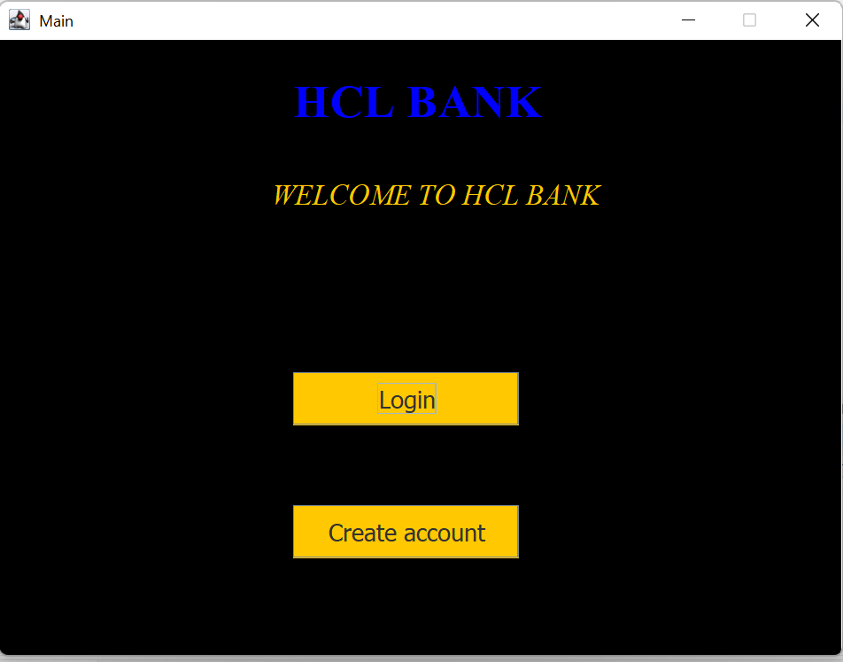

# BankMangmentSystem
The java-based Bank Management System .

## Project Overview

The java-based Bank Management System  is a robust software application built using SWing, AWT, and JDBC  Java FramWorks. This System is responsible for optimizing various banking operations. Providing a user-friendly interface for efficient management of customer accounts, transactions, and financial processes. 

## Features and Functionalities

1. User Authentication and Authorization:
 - Secure login using Swing components.
2. Customer Management:
 - Capture and store customer information through AWT forms.
 - Account creation and management functionalities for different account types.
3. Transaction Processing:
 -  Real-time processing of deposits, withdrawals, and fund transfers using Swing components.
 -  Transaction history tracking with JDBC for data persistence.
4. Account Balances and Statements:
 - Display of account balances and transaction history using Swing UI components.
 - Generation and printing of account statement in the form of PDF.
5. Interest Calculations:
- Automated interest calculations for various account types.
- JDBC for storing and updating interest-related data.
6. Reporting and Analytics:
- Utilization of Swing and AWT for creating reports.
- JDBC for querying and retrieving data for analytical purposes.
7. Alerts and Notifications:
- Implementation of alerts and notifications using Swing components.
- JDBC for storing and retrieving notification preferences.
8. Security and Audit Trail:
  - Secure handling of user credentials using JDBC.
  - JDBC for recording detailed audit trails to track system activities.

## Technology Stack
 - User Interface: Java Swing and AWT
 - Database Connectivity: JDBC
 - Database Management System: Any JDBC compatible relational database (e.g., MySQL, Oracle)
 - Programming Language: Java

## Project Benefits
   
- Cross-Platform Compatibility: Java enables the application to run on various operating systems.
- User-Friendly Interface: Swing and AWT provide a visually appealing and interactive UI.
- Reliable Data Persistence: JDBC ensures secure storage and retrieval of banking data.
- Scalability: The modular design allows for easy integration of additional features.

